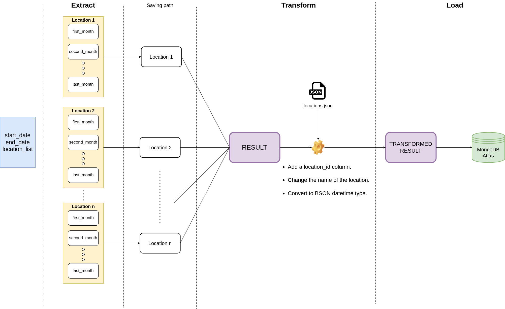
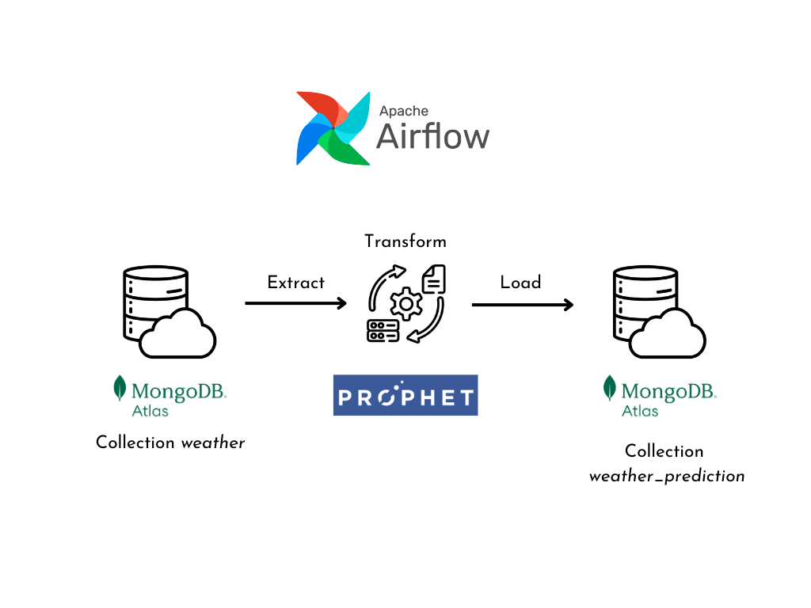

## Data pipeline for weather forecast project

Data pipeline for grab bootcamp project

### Prerequisites

Newest version of these packages, tools:

- pymongo
- airflow
- prophet
- pandas

### Structure

This repo contains 2 folders:

- collect_historical_data: collect historical weather data from `start_date` to `end_data` in Vietnam, use file **config.yml** to configure the project

- workflow: the Airflow dags project which manages workflow to collect the current weather data, forecast weather data in Vietnam

```
.
├── collect_historical_data
│   ├── config.yml
│   ├── extract.py
│   ├── helper.py
│   ├── load.py
│   ├── locations_extract.json
│   ├── locations.json
│   ├── main.py
│   └── transform.py
├── LICENSE
├── readme.md
└── collect_cur_and_predict
    ├── collect_data_dag.py
    ├── predict_data_dag.py
    ├── __init__.py
    └── modules
        ├── config.yml
        ├── collect_data
        |   ├── __init__.py
        │   ├── checkpoint.json
        │   ├── extract.py
        │   ├── load.py
        │   ├── locations_extract.json
        │   ├── locations.json
        │   └── transform.py
        ├── __init__.py
        └── predict_data
            ├── __init__.py
            ├── extract.py
            ├── load.py
            ├── train_model.py
            └── transform.py

```

### Workflow

**Collect historical data**



**Collect current data**


**Predict future**



### Running

- collect_historical_data: 

Change configs in **config.yml** file

```
python extract.py # run this first to collect raw data 
python main.py # run this second to transform and load data to database
```

- collect_cur_and_predict:

To run Airflow dags, you should have knowledge in Apache Airflow and ETL pipeline concept. Read this official document for more information about Airflow: https://airflow.apache.org/docs/

This folder contains 2 Airflow data piplines: collect the current weather data and forecast weather data

Main files for these dags: **collect_data_dag.py** and **predict_data_dag.py**
